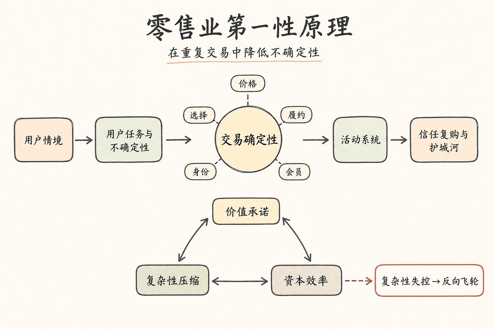
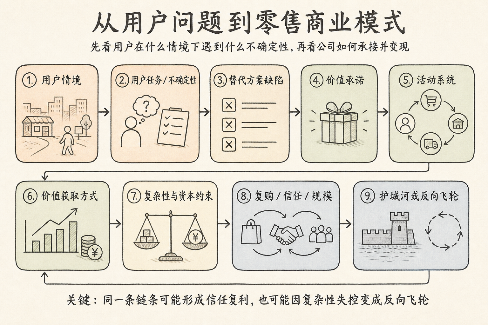
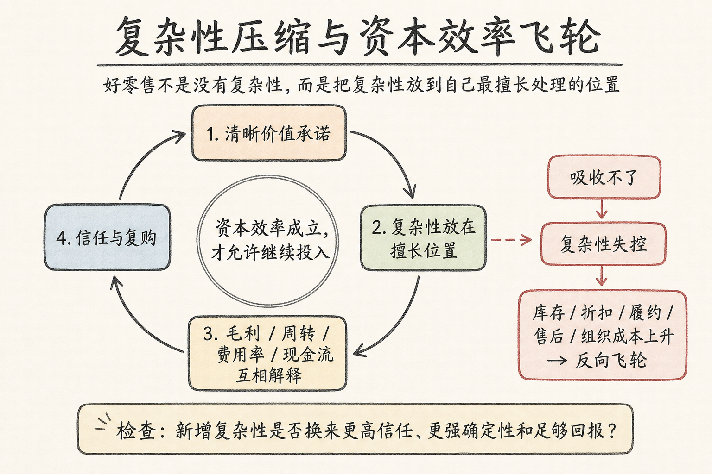

# 零售业第一性原理：价值确定性、复杂性压缩与资本效率

**状态：** v0.3 compressed draft  
**日期：** 2026-05-31  
**性质：** 行业方法论 / 投资判断框架 / 创业问题库  
**主问题：** 零售业真正的本质是什么？是供应链竞争，还是更底层的东西？  

---

## 摘要

本文试图回答一个上位问题：零售业的第一性原理究竟是低价、供应链，还是更底层的东西。本文的结论是，零售业的本质是在重复交易中降低不确定性：对消费者，把复杂供给压缩为更可信、更省心的购买选择；对供应端，把分散需求组织成更可预测、更可服务、更可规模化的订单流。

由此，零售公司的分析起点不应是“卖什么”或“SKU 多/少”，而应是“用户在什么情境下雇佣它完成什么任务”。价格、选择、履约、风格/身份、会员关系，都是不同形式的交易确定性。供应链是最硬的后端能力，但它不是独立答案；真正重要的是顾客价值承诺与后端履约系统是否一致。

本文提出的判断框架是：用户情境 → 用户任务/不确定性 → 替代方案缺陷 → 价值承诺 → 活动系统 → 价值获取方式 → 复杂性与资本约束 → 复购/信任/规模 → 护城河或反向飞轮。优秀零售公司不是没有复杂性，而是把复杂性放到自己最擅长处理的位置，并用毛利、周转、费用率、复购和现金流证明资本效率成立。

对投资和创业而言，核心问题不是“这个模式看起来有没有需求”，而是：用户到底信它什么；公司用什么系统承接这种信任；每新增一层复杂性，是否带来更高确定性、更强复购和足够覆盖成本的资本回报。AI 可能重写搜索、推荐和购物入口，但不会取消商品生产、库存、履约、退货、品控和信任这些物理约束。因此，未来零售公司的护城河会更集中在真实低成本供给、履约能力、信任治理和关系契约上，而不是单纯前端流量。

**关键词：** 零售业；交易确定性；用户任务；供应链；复杂性压缩；资本效率；AI 购物入口

---

## 0. 本文定位与阅读路线

本文不是 PDD coverage，也不是全球零售史综述。它是一个通用判断框架，用来服务后续研究：PDD、Costco / Walmart / Sam's、盒马 / 小象 / 多多买菜、消费电子渠道、品牌零售，以及可能的消费 / AI commerce 创业方向。

阅读路线：

1. 只想重建结论：读摘要和上图。
2. 想理解框架：读第 1-5 节。
3. 想快速判断公司：用第 8 节检查清单。
4. 想继续做研究：看第 10 节证据清单。

这篇文章修正上一版 deep research 的地方在于：不再围绕“做少不做多”这个口号展开，而是把问题上移到用户任务、交易确定性、复杂性和资本效率。

---

## 1. 核心定义：零售是在重复交易中降低不确定性

零售表面上是卖商品，本质上是在重复交易中降低不确定性。

消费者面对的不确定性：值不值、贵不贵、质量稳不稳、怎么选、多久到账、退货售后麻不麻烦、买完会不会后悔。

供应端面对的不确定性：需求在哪里、生产多少、怎么定价、如何触达、库存和现金流怎么周转、谁承担退货售后和渠道风险。

零售商 / 零售平台的价值，就在于重新组织这两边的不确定性：

> 对消费者，把复杂供给世界压缩成更可信、更省心的购买选择。  
> 对供应端，把分散需求组织成更可预测、更可服务、更可规模化的订单流。

所以第一性问题不是“卖什么”，而是三问：

1. 你替谁降低了哪一种不确定性？
2. 你用什么系统吸收这种不确定性？
3. 你还能不能在吸收复杂性的同时赚钱？

---

## 2. 总框架：从用户问题到商业模式

零售研究不要先从行业分类开始，而要先从用户在具体情境下的任务开始。一个人可以同时是便利店用户、山姆用户、PDD 用户、Apple Store 用户和品牌用户，因为他在不同场景里要完成不同任务。

可以用两个朴素公式理解：

> 用户价值 = 被解决的问题强度 × 发生频率 × 替代方案缺陷 × 信任程度

> 公司价值 = 用户愿意支付的价格 - 交付总成本 - 获客成本 - 信任维护成本 - 资本占用成本

这就是为什么“有需求”不等于“是好生意”。用户确实想要更快生鲜配送，但前置仓、骑手、损耗和密度成本可能吃掉价值；用户确实想要更多选择，但更多 SKU 可能带来库存和认知成本。

---

## 3. 零售卖的五种交易确定性

| 确定性 | 用户真正买的东西 | 代表业态 / 公司 | 最怕的反证 |
|---|---|---|---|
| 价格确定性 | 不担心买贵，相信长期便宜 | Walmart、Aldi、Lidl、Costco、PDD 一部分 | 低价靠补贴；费用率上升；价格信任破坏 |
| 选择确定性 | 你帮我筛过了，我不用痛苦比较 | Costco、Trader Joe's、Sephora、山姆部分逻辑 | SKU 扩张后质量不稳；精选变杂货堆 |
| 履约 / 时间确定性 | 我要的时候能稳定拿到，出问题能解决 | Amazon、京东、便利店、即时零售、盒马 | 履约成本长期吃掉毛利；用户只为补贴而来 |
| 风格 / 身份确定性 | 这个东西表达我，降低审美和身份选择风险 | Zara、Nike、Lululemon、泡泡玛特、奢侈品 | 审美过时；库存错配；折扣伤品牌 |
| 关系 / 会员确定性 | 长期省钱、省心、被筛选、被服务 | Costco、Sam's、Prime、订阅制服务 | 会员价值下降；会员费从 moat 变负债 |

低价、精选、品牌、会员、便利、售后，都是降低不确定性的不同方式。差别在于：用户把哪一类成本交给公司承担。

| 用户想转移的成本 | 用户想避免什么 | 零售公司如何承接 |
|---|---|---|
| 金钱成本 | 买贵、被坑、总成本不确定 | 低价、会员价、价格信任、比价透明 |
| 时间成本 | 花时间找、等、退换、比较 | 便利、即时履约、一站式、默认选择 |
| 认知成本 | SKU 太多、不知道哪个好 | 精选、榜单、推荐、品牌、导购 |
| 质量风险 | 假货、差品控、售后麻烦 | 正品保障、质检、自营、退货、品牌背书 |
| 情绪成本 | 后悔、焦虑、选择困难、身份不匹配 | 品牌、审美、社群、稀缺、礼品确定性 |
| 机会成本 | 错过更低价、更好新品、更合适产品 | 趋势响应、上新、价格监测、平台分发 |

---

## 4. 供应链：最硬的后端能力，但不是独立答案

供应链当然重要，因为它决定采购成本、品控稳定性、库存周转、断货率、损耗、履约速度、退货、现金转换周期。

但“供应链强”本身不是答案。不同顾客价值承诺，需要不同供应链结构。

| 如果顾客价值是 | 供应链 / 后端系统要变成 |
|---|---|
| 低价 | 降本机器：规模采购、低费用率、高周转 |
| 精选 / 品质信任 | 筛选和质量控制系统：少 SKU、高命中率、稳定品控 |
| 便利 | 近场履约网络：仓、店、骑手、库存密度 |
| 时尚 | 快速响应和库存风险控制系统：小单快反、快速补货 |
| 品牌身份 | 服从稀缺感、调性和全价销售的渠道系统 |
| 平台低价 | 被平台规则、算法、商家竞争和售后治理重新组织的供给系统 |
| 会员信任 | 持续兑现长期关系的采购、品控和履约系统 |

更准确的命题是：

> 零售是顾客价值承诺与后端履约系统之间的一致性竞争。供应链是其中最硬、最难伪装的一层，但不是唯一一层。

---

## 5. 复杂性压缩与资本效率：零售的真正审判

“少”的本质不是 SKU 少，而是复杂性压缩。零售公司会同时面对六类复杂性：需求、供给、库存、履约、认知、组织。

优秀零售公司不是没有复杂性，而是把复杂性放到自己最擅长处理的位置。

| 公司 / 业态 | 把复杂性压到哪里 | 前端给用户什么 |
|---|---|---|
| Costco | 后端选品、采购、会员纪律 | 少数可信选择 + 价格信任 |
| IKEA | 产品设计、包装、自组装、供应链一体化 | 可负担设计 |
| Zara | 快反供应链、上新节奏、库存控制 | 持续参与流行 |
| Amazon | 仓网、评价、Prime、搜索和平台规则 | 供给宽度 + 履约确定性 |
| PDD | 商家竞争、价格发现、供给治理、售后规则 | “值不值”的简单判断 |
| 奢侈品 / 品牌零售 | 审美、身份、稀缺、渠道控制 | 社会符号和风格确定性 |

关键检查：

> 每增加一层复杂性，是否带来更高顾客信任、更强确定性，以及足够覆盖复杂性成本的毛利或复购？否则复杂性就是毒药。

因此，零售最终不能只看毛利，也不能只看 GMV / revenue growth。高毛利可能被租金、人力、营销、库存、折扣、退货和履约吃掉；低毛利也可能因高周转、低费用率、强现金转换、会员费或广告利润池而成为好生意。

核心联立指标：

| 维度 | 关键问题 |
|---|---|
| 毛利 | 来自商品力、品牌力、采购力，还是补贴？ |
| 周转 | 库存和现金转得快不快？预测错误会不会沉淀成库存？ |
| 费用率 | 门店、人力、营销、履约、平台治理是否吃掉毛利？ |
| 复购 | 用户回来是因为信任、习惯、会员，还是补贴？ |
| 折扣 / 损耗 | 卖不掉、退货、清仓、生鲜损耗是否侵蚀利润？ |
| ROIC / GMROI | 投入资本是否真的产生超额回报？ |
| 现金流 | 利润是否能变成现金？营运资本是否友好？ |

---

## 6. 全球零售原型速查

这不是完整公司研究，只是建立公平尺子：不同业态卖的确定性不同，不能用同一把尺子乱量。

| 原型 | 卖的确定性 | 优势 | 风险 | 核心指标 |
|---|---|---|---|---|
| EDLP：Walmart / Aldi / Lidl | 长期便宜和日常确定性 | 成本纪律、规模采购、高周转 | 成本上升；价格信任破坏 | 费用率、周转、价格指数、同店、现金转换 |
| 会员精选：Costco / Sam's | 可信低价 + 替你选过 | 会员费、少 SKU、高复购 | 会员价值下降；精选感稀释 | 续费率、会员费、SKU 纪律、客单、私有品牌质量 |
| 设计降本：IKEA / Decathlon | 可负担设计 / 专业性 | 产品工程与供应链一体化 | 扩品类引入新复杂性 | 新品命中率、库存周转、退货 / 质量 |
| 快速趋势：Zara / Shein | 更快更便宜地参与流行 | 小单快反、上新频率 | 库存、退货、合规、审美疲劳 | 周转、折扣率、退货率、上新速度 |
| Off-price：TJX / Ross | 低价 + 寻宝 | 利用他人库存错配 | 优质库存来源不稳定，电商化难 | 采购纪律、库存来源质量、同店、周转 |
| 便利 / 即时：便利店、盒马、小象 | 时间确定性 | 高频近场、数据密度 | 前置仓 / 骑手 / 损耗吃掉价值 | 订单密度、履约成本 / 单、损耗率、复购 |
| 平台型：Amazon / PDD / Alibaba | 供给组织与分发效率 | 多利润池，商家承担部分库存风险 | 信任治理、广告负载、平台责任 | 复购、商家质量、take rate、广告负载、投诉 / 退货 |
| 品牌 / 身份：Nike、Lululemon、泡泡玛特、奢侈品 | 风格、身份、情绪 | 高毛利、支付意愿、渠道强化品牌 | 审美周期、库存折扣、高费用率 | 全价销售率、毛利、库存、渠道质量、核心用户认同 |
| 百货 / 大而全 | 曾经的一站式集合价值 | 位置、服务、品牌集合 | 被电商、直营、专业店、社媒和搜索拆解 | 客流、坪效、租售比、品牌吸引力 |

百货是重要反面教材：当一个业态承担很多复杂性，却不再拥有相应顾客价值和利润池，它就会被拆解。

### 6.1 现制饮品补充判断：为什么蜜雪 / 古茗不按可口可乐处理

现制饮品可以是好生意，但不能因为“饮料 + 高频 + 大门店数”就类比可口可乐。可口可乐的强在于低变化率产品、全球默认心智、瓶装/货架/餐饮分销和可验证的提价权；现制茶饮/现制饮品则把复杂性放在门店操作、加盟商管理、食品安全、鲜品供应链、选址密度、人员执行和产品上新上。

当前结论：**不把蜜雪、古茗作为长期核心消费资产候选；除非未来有很强的新证据，否则不投。**

- **蜜雪的问题**：它最接近“平价现制饮品默认入口”，但极致低成本 + 高加盟比例 + 海量门店天然和食品安全、操作一致性、加盟商盈利之间存在结构张力。低价心智也限制提价权；总部利润若来自压缩加盟商/供应链或门店密度继续上升，长期生态可能被透支。
- **古茗的问题**：它更像强产品快反 + 区域密度 + 鲜果冷链公司。产品力和供应链能力很强，但复购高度依赖新品、口味、鲜果茶周期和 10-20 元价格带竞争；这更接近产品周期公司，而不是低变化率的全球饮料 franchise。
- **底层判断**：现制饮品的关键复杂性很难被彻底压缩。低价、上新、加盟扩张和食品安全/单店回报之间很难同时最优；当一个模式必须持续在这些约束间走钢丝时，即使公司优秀，也不适合作为“熨平周期”的长期核心仓。

后续若研究，只当行业认知样本和中周期机会看，不按“下一个可口可乐”估值；必须重点验证：加盟商真实回本周期、同店/单店 GMV、闭店率、食品安全事件、总部与加盟商利润分配、是否有不伤害需求的提价权。

---

## 7. AI 时代：入口会变，物理约束不会变

AI 会改变零售前端，但不会取消原子世界约束。

| AI 更可能改变 | 不会被取消的后端约束 |
|---|---|
| 搜索、推荐、比价 | 商品仍要生产 |
| 内容生成、个性化营销 | 库存仍要承担 |
| 客服、导购、商家运营工具 | 包裹仍要送达 |
| Agent 购物入口 | 退货仍要处理 |
| 供应链预测和补货建议 | 质量仍要控制 |
| 需求识别和价格监测 | 用户仍要相信某个交易对手 |

如果 Agent 帮用户买东西，它最终仍要回答：哪里最低可信到手成本、哪个平台履约最稳定、哪个品牌质量最可信、哪个渠道不会让我后悔。

所以更稳的判断是：

> 前端决策界面会变化，但后端价值交付约束不消失。

后端能力强的零售商未必受损；只靠 App 流量、搜索广告、首页分发赚钱的平台，会更容易丢失界面权力。

---

## 8. 判断一家零售公司的十个问题

| # | 问题 | 为什么重要 |
|---|---|---|
| 1 | 它替用户降低了哪种不确定性？ | 先确定它卖的不是商品，而是哪种交易确定性 |
| 2 | 用户为什么复购？ | 区分信任、习惯、会员、身份和补贴 |
| 3 | 低价 / 高毛利 / 高复购来自结构，还是短期投入？ | 结构性优势能复利，补贴和流量套利不能 |
| 4 | 它把复杂性放在哪里？ | 看组织是否真的能吸收，而不是让用户或财务报表承担 |
| 5 | 每增加一个品类 / SKU / 服务 / 场景，是降低决策成本，还是增加理解成本？ | 扩张不必然坏，但必须服务清晰价值承诺 |
| 6 | 供应链能力服务什么目标？ | 降本、品控、速度、精选、便利、稀缺、平台治理是不同系统 |
| 7 | 利润池在哪里？ | 商品毛利、会员费、广告、佣金、金融、服务、品牌溢价不能混看 |
| 8 | 毛利、费用率、周转、复购是否同向改善？ | 单一指标好看不够，好模型的指标应互相解释 |
| 9 | 最怕什么反证？ | 价格信任破坏、库存积压、折扣加深、履约成本失控、核心用户逃离、商家生态恶化、会员续费下降 |
| 10 | 如果 AI 改变前端入口，它剩下什么？ | 剩真实低成本供应链、履约和信任，还是只剩 App 流量和广告位？ |

---

## 9. 对 PDD 与创业的启发

这篇不直接判断 PDD，但会改变我们怎么判断 PDD。

不要先问：PDD PE 低不低、现金多不多、Temu 增速快不快。先问：

- PDD 降低的是价格不确定性，还是选择 / 质量 / 履约不确定性？
- 它的低价有多少来自结构性低成本，有多少来自利润表投入？
- 供应链投入是在形成长期资产，还是维持增长？
- 它能不能把“便宜”升级为“便宜且可信”？
- 新拼姆 / 自营 / 品牌化，是向后做深，还是向前做多？
- 如果 Agent 接管前端购物入口，PDD 的后端低成本供给和可信履约是否仍会被调用？

对创业也一样。不要先问“我们卖什么”，而要问：

> 我们替用户降低了什么不确定性？我们把复杂性吸收到哪里？我们有没有资本效率和组织能力承受它？

---

## 10. 下一步证据清单

这仍然是框架稿，不是最终行业研究。下一步需要补证据，而不是继续堆概念。

### A. 全球零售原型案例包

每类至少补 1-2 家代表公司：EDLP、会员精选、设计降本、快速趋势、Off-price、便利 / 即时、平台型、品牌 / 身份、百货失败样本。

### B. 指标对照表

不同原型用不同指标，不用同一把尺子乱量：

- EDLP：费用率、周转、价格指数、同店。
- 会员：续费率、会员费、SKU 纪律、客单、复购。
- 快时尚：上新速度、折扣率、库存周转、退货率。
- 平台：take rate、广告负载、商家质量、退货 / 投诉、履约成本。
- 品牌零售：全价销售率、毛利率、库存、核心用户认同。
- 即时零售：订单密度、履约成本 / 单、损耗率、复购。

### C. 失败样本库

不能只研究赢家。需要专门看：百货为什么被拆解，DTC 品牌为什么增长后亏损，生鲜电商 / 前置仓为什么难，快时尚为什么容易库存和品牌风险，平台低价为什么可能伤害商家和信任，会员店为什么可能变成“伪精选”。

### D. 中国零售特殊性

中国零售不是美国零售复刻。需要单独研究：中国供应链密度、用户价格敏感度、平台补贴历史、直播电商和内容电商、即时零售、社区团购、白牌 / 厂牌 / 新品牌、出海和跨境履约。

---

## 11. 当前压缩句

1. 零售卖的不是商品，而是交易确定性。
2. 行业是重复出现的用户问题集合；商业模式是解决这类问题所需的活动系统。
3. 用户付费不是为功能本身，而是把金钱、时间、认知、质量、情绪和机会成本中的一部分交给公司承担。
4. 供应链是零售最硬的后端能力，但它必须服务某个清楚的顾客价值承诺。
5. 低价不是护城河，结构性低成本和价格信任才是。
6. “少”的本质不是 SKU 少，而是把用户和组织无法承受的复杂性压缩掉。
7. 优秀零售公司不是没有复杂性，而是把复杂性放到自己最擅长处理的位置。
8. 战略就是选择要解决谁的问题，也选择不解决谁的问题；没有取舍的零售公司最后会被复杂性吃掉。
9. 零售最终由资本效率审判：毛利、周转、费用率、复购和现金流必须能互相解释。
10. AI 会重写前端入口，但不会取消商品生产、库存、履约、退货、品控和用户信任这些物理约束。
11. 判断零售公司，先问用户到底信它什么；再问公司用什么系统承接这种信任。

如果只能记住一个框架：

> 用户情境 → 交易确定性 → 活动系统 → 复杂性位置 → 资本效率 → 信任复购。

如果只能记住一个判断：

> 好零售不是更便宜、更全、更快、更有调性中的某一个，而是清楚选择一种用户愿意长期信任的确定性，并用一套不会被复杂性和资本占用反噬的系统反复兑现它。

---

## 参考与来源

- 旧 deep research 报告：`/mnt/g/我的云端硬盘/03_Work/Projects/deep-research-engine/cases/retail-first-principle/runs/20260420_093153_full_v1_unbounded_combined/report.md`
- 旧讨论归档：`/mnt/g/我的云端硬盘/01_MyBrain/40_Archive/10_Inbox_Cleared/business_supporting_discussions/2026-04-21_拼多多、零售的一阶规律与新拼姆.md`
- Christensen / Jobs-to-be-Done：用于避免把用户简化成人口标签，强调具体情境里的任务。
- Porter / Strategy trade-offs：用于判断活动系统和战略取舍。
- Value Proposition Canvas / Product-market fit：用于连接 customer jobs、pains、gains 与商业模式。
